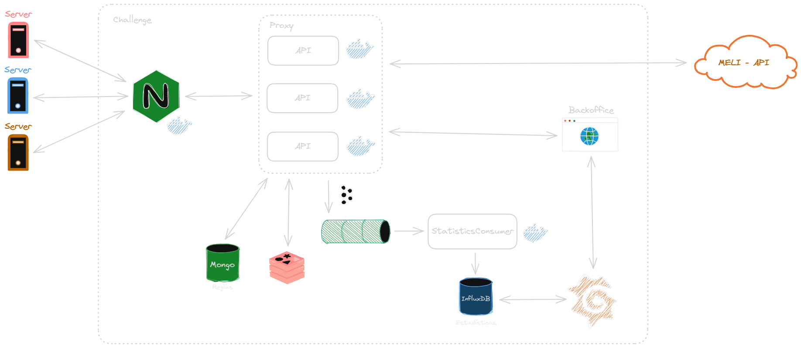

# Desafío Técnico - "Proxy de APIs"

## Descripción
Mercadolibre hoy en día corre sus aplicaciones en más de 20.000 servidores, estos suelen comunicarse entre sí a través de apis, algunas accesibles desde el exterior (api.mercadolibre.com). Uno de los problemas que tenemos actualmente es como controlar y medir estas interconexiones. Para esto necesitamos crear e implementar un "proxy de apis".

## Requisitos

- Docker
- Docker Compose

## Despliegue

El proyecto se puede levantar ejecutando el siguiente comando en la raíz del proyecto:

```bash
docker-compose up --build -d --scale app=N
```

Donde `N` es el número de instancias que se levantan de la api.

## Endpoints

### POST /rules

Este endpoint permite crear una nueva regla.

El cuerpo de la solicitud debe ser un objeto JSON con los siguientes campos:

- `ip`: La dirección IP a la que se aplicará la regla. Debe ser una cadena de texto que represente una dirección IP válida. También se puede dejar en blanco para aplicar la regla a todas las direcciones IP.
- `path`: La ruta a la que se aplicará la regla. Debe ser una cadena de texto que represente una ruta válida en la API. También se puede dejar en blanco para aplicar la regla a todas las rutas.
- `max_requests`: El número máximo de solicitudes permitidas desde la dirección IP especificada a la ruta especificada en el tiempo especificado. Debe ser un número entero.
- `time`: El tiempo, en segundos, durante el cual se aplicará la regla. Debe ser un número entero.

### Ejemplo de solicitud

```bash
curl --location 'http://localhost:8080/rules' \
--header 'Content-Type: application/json' \
--data '{
    "ip": "192.168.0.1",
    "path": "/categories/MLA1743",
    "max_requests": 10,
    "time": 60
}'
```

### GET /{PATH}

Este endpoint permite obtener el resultado de hacer un GET a `https://api.mercadolibre.com/{path}`.

El resultado será un error 429 (Too Many Requests) si se supera el límite de solicitudes permitidas por alguna regla definida previamente o el resultado de la solicitud a la API de MercadoLibre en caso contrario.

### Ejemplo de solicitud

```bash
curl --location 'http://localhost:8080/categories/MLA1743'
```

## Arquitectura

La arquitectura propuesta para la solución del desafío es la siguiente:

- **Nginx**: Se utiliza únicamente como balanceador de carga. Esto permite escalar la aplicación de forma horizontal y distribuir la carga entre las distintas instancias de la API para soportar 50.000 solicitudes por segundo como se pide en el desafío. El mismo va a estar escuchando en el puerto 8080 y va a redirigir las solicitudes a las distintas instancias de la API.
- **API**: Se encarga de recibir las solicitudes, aplicar las reglas definidas y redirigir las solicitudes a la API de MercadoLibre. También se encarga de dar de alta las reglas y de publicar en la queue de estadísticas las solicitudes que se están realizando.
- **Redis**: Se utiliza para almacenar en tiempo real las solicitudes que se están realizando y poder contarlas para aplicar las reglas definidas.
- **MongoDB**: Se utiliza para almacenar las reglas definidas por los usuarios.
- **Kafka**: Se utiliza para publicar los eventos que suceden en la API y poder consumirlos en tiempo real para generar estadísticas. Decidí utilizar una queue para no bloquear la API y poder procesar las estadísticas en paralelo, además de desacoplar la lógica de la API de la lógica de las estadísticas y de no perder los datos en caso de que se caiga el servicio de estadísticas.
- **InfluxDB y Grafana**: Se utilizan para almacenar y visualizar las estadísticas de las solicitudes que se están realizando. InfluxDB es una base de datos de series temporales que permite almacenar los datos de las solicitudes y Grafana es una herramienta de visualización de datos que permite crear dashboards con los datos almacenados en InfluxDB.
- **Backoffice**: Se utiliza para administrar las reglas definidas por los usuarios y visualizar las estadísticas de las solicitudes que se están realizando.

Este proyecto contempla únicamente la primera parte de la solución propuesta, la cual consiste en el proxy en si. Queda pendiente agregar la parte de estadísticas con grafana y un backoffice para la administración de las reglas y la visualización de las estadísticas.

### Diagrama de la arquitectura


